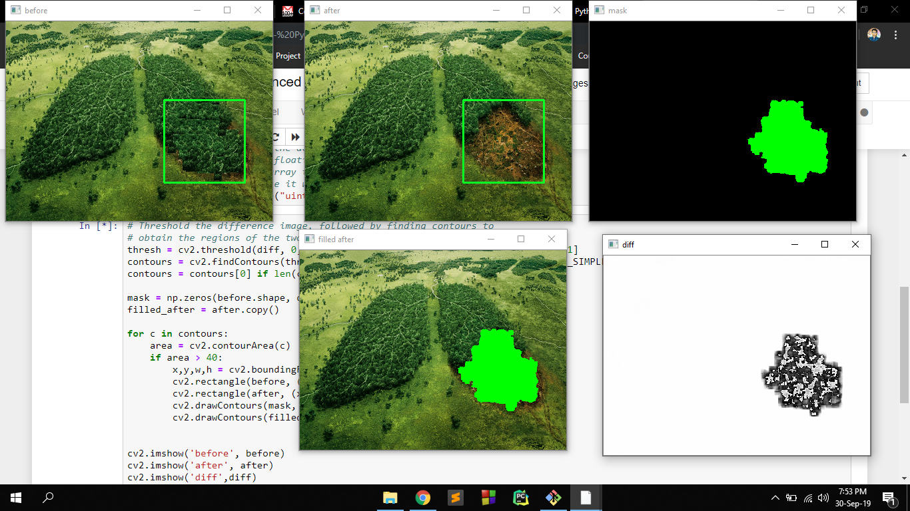

# Save The World - NSU Inception

<h2>NASA Space App Challange 2019</h2>

<h2>Project Idea:</h2> 

Our Project name is “Saving The World.” We are working to save our land. We aim to establish a green environment where Human beings, animals, insects, and everything will be saved within one idea. People who work in Farming including Animals, Crops, Land, Waterlogging issues, etc. 
We are making an app and also working with some Data to analyze in Machine Learning. Our main agenda to provide consultancy services from Experts. User can take a pic and upload on our server and get the result. There are some services also. And also precautions for User. 

We are using different platforms but the app is our main thing to navigate all the data. We are using Machine Learning Technology to analyze Data of entire activities through the apps. Where people can get a good support from this app which actually meets the SDGs goal. We are working to improve life on Land. this is one goal of SDGs. So, we think our app will get advantages to reach SDGs goal. 

App Designs are very normal to use. Firstly, the User needs to sign up on our app to get the services. After sign up, Users can see Problem Selection Window. Here are 5-6 drop-down options to select any one. including Crops Issues, Land Quality, Animals Issues, Water Issues, Any New Diseases. If anyone selects Crops issues then he/she will get new window. in this phase we keep 3 vital options such as upload your crops pic. When someone would upload pics of damaged crops. We will analyze it with our stored good quality crops pic. User will get the result. As the result appears User can text to expert for the next steps. User can text our expert panel for advice or call live. Thus we are solving a huge problem on Our land issues including Animal Diseases, Water quality, Land quality etc. those are SDGs goal to reach a good level. Aside these, We will strore those Data on our Database to provide good service to user. By using Machine Learning Technology we can reduce risk of everything under this app. A good Land on Life would be saved. We have two more options such as SOS and Service. In SOS, Anyone can call, text to particular Emergency Team. Fire Alarm, Hazards, Cyclone alerts etc. In Nursing option, People can order Agro things and also can buy. Tress can be order through app.

If we can provide all of these we can ensure a green world. Nature is everything. it can be game-changing idea to save our world, also full filling our SDGs goal. Life on Land would be up to the mark. We can also analyze the green area from Satellite how we are improving and what can be happened if we don't plant enough trees. All happening under one crazy idea. NASA can also implement it anywhere.it's a common issues on today's world. If NASA doesn't give any interest on it. We can implement it in Bangladesh.

<h2>Tools</h2>
<ul>
  <li>Python</li>
  <li>Jupyter Notebook</li>
  <li>Java (back-end)</li>
  <li>XML(front-end)</li>
</ul>

<h2>Implmentation</h2>
<b>App :</b> 

Added activities on App: 
<ul>
  SplashScreen 
  Navigation Bar 
  Ongoing 
</ul>

<b>Machine Learning Model:</b>   

<b>Project members:</b>
<ul>
<li>
Md. Masudur Rahman(1631189042) 
email : masudurhimel@gmail.com
</li>
<li>
Md. Rashad Tanjim (1620952042) 	
email : rashad.tanjim@northsouth.edu
</li>
<li>
Kazi Tamzid Akhter Md Hasib 
email : kazihasib.sunny@gmail.com
</li>
 <li>
Afsin Orny 
email : afsinorni@gmail.com
</li>
</ul>

<b>##License & copyright</b> 
© Md. Masudur Rahman, Md. Rashad Tanjim, Kazi Tamzid Akhter Md Hasib, Afsin Orny 

<b>GitHub Link:</b> <a>https://github.com/masudurHimel/Save_The_World</a>
